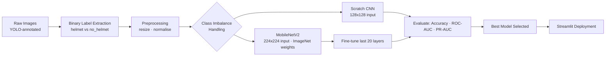

# Machine-Learning-Capstone-Project---PPE-Compliance-Monitoring-using-CNNs-and-MobileNetV2
It is a computer vision application developed to automatically determine whether a construction worker is wearing a safety helmet. The system uses CNNs and transfer learning with MobileNetV2 to classify images as either Compliant or Non-Compliant.

<div align="center">

# 🦺 PPE Compliance Monitoring System
### Real-Time Safety Helmet Detection using CNNs & MobileNetV2 Transfer Learning

[](https://www.python.org/)
[](https://www.tensorflow.org/)
[](https://streamlit.io/)
[](LICENSE)
[](#-results)

**A binary image classifier that determines whether a construction worker is wearing a safety helmet — built from scratch as a CNN, then improved 8 percentage points using MobileNetV2 transfer learning, and deployed as a live web application.**

[Live Demo](#-live-demo) · [Results](#-results) · [Quick Start](#-quick-start) · [Project Structure](#-project-structure) · [Documentation](#-full-documentation)

</div>

---

## 📌 Overview

Workplace injuries from missing Personal Protective Equipment (PPE) remain one of the leading causes of preventable harm on construction sites. Manual safety inspections don't scale — they're slow, inconsistent, and impossible to run continuously across a large site.

This project builds an automated computer vision pipeline that classifies worker images as **Compliant (helmet)** or **Non-Compliant (no helmet)** in real time, and ships it as a usable Streamlit application rather than leaving it in a notebook.

**Why this project is worth a second look:**
- Two full modelling approaches compared head-to-head, not just one model trained once
- Class imbalance (3.6:1) explicitly diagnosed and handled with two different mitigation strategies, benchmarked against each other
- Evaluated with the metrics that actually matter for a safety system — ROC/AUC, precision-recall, confusion matrices, and a manual error analysis of every single misclassified image
- Shipped: a working, interactive deployment, not just a `.ipynb` file
- Honest about where the model fails, including a documented fairness limitation

---

## 🎯 Results

| Model | Test Accuracy | AUC | Avg. Precision |
|---|---|---|---|
| Naive majority-class baseline | 82.1% | — | — |
| CNN from scratch | 90.3% | 0.975 | 0.995 |
| CNN + class weighting | 92.5% | — | — |
| CNN + oversampling | 92.5% | 0.975 | 0.995 |
| **MobileNetV2 (transfer learning, fine-tuned)** | **98.5%** | **0.988** | **0.997** |

> MobileNetV2 misclassified only **2 images out of 134** in the test set — both of which were out-of-domain (an indoor portrait and a night-time cycling photo), not actual construction-site failures.

<p align="center">
  
</p>

<p align="center">
  
  
</p>

<details>
<summary><b>📈 Click to see training curves (frozen base vs fine-tuned)</b></summary>
<br>
<p align="center">
  
</p>
</details>

---

## 🖥️ Live Demo

The trained MobileNetV2 model is deployed as an interactive Streamlit app with four pages:

| Page | What it does |
|---|---|
| 🏠 **Home** | Project overview and model quick-stats (98.5% accuracy, MobileNetV2, binary classification) |
| 🔍 **Prediction** | Upload an image, adjust the decision threshold, get an instant compliance verdict + confidence score |
| 📊 **History** | Review the last 10 predictions with timestamp and confidence |
| ℹ️ **About** | Model details and project goals |

```bash
streamlit run app/PPE_appNewFinal.py
```

> Want to see it without running it locally? A short screen-recording walkthrough is linked in ("C:\Users\marth\Desktop\PPE DATASET\ppe-repo\docs\images\Demo.mp4").

---

## 🧠 Approach

Two architectures were trained and compared on the same data and the same evaluation protocol:

**1. Custom CNN (from scratch)** — two convolutional blocks (32 → 64 filters) with max pooling, followed by a dense classifier head with dropout. Trained at 128×128 resolution. This is the baseline that establishes what's achievable without any pretrained knowledge.

**2. MobileNetV2 (transfer learning + fine-tuning)** — ImageNet-pretrained MobileNetV2 used as a frozen feature extractor, with a custom classification head (`GlobalAveragePooling → BatchNorm → Dense(128) → Dropout → Sigmoid`) trained on top. The last 20 base layers were then unfrozen and fine-tuned at a much lower learning rate to adapt low-level features to the PPE domain.

Three class-imbalance strategies were benchmarked against each other rather than picked arbitrarily: **class weighting**, **oversampling**, and **oversampling + augmentation**. The full reasoning and run-by-run comparison is in the [experiment log](docs/PPE_Compliance_Monitoring_Documentation.docx).



---

## 📂 Project Structure

```
ppedataset/
│
├── notebooks/
│   └── PPE_Compliance_Monitoring.ipynb   # Full training & evaluation pipeline
│
├── app/
│   └── PPE_app.py                        # Streamlit deployment application
│
├── models/
│   ├── mobilenet_ppe_model.keras         # Saved production model (Git LFS / Release asset)
│   └── class_names.json                  # ["No Helmet", "Helmet"]
│
├── docs/
│   ├── PPE_Compliance_Monitoring_Documentation.docx   # Full ML documentation (data card, model card, experiment log)
│   ├── PPE_Presentation_Speaker_Script.docx           # Presentation script
│   └── images/                           # Result charts used in this README
│
├── requirements.txt
├── LICENSE
├── .gitignore
└── README.md
```

---

## 🚀 Quick Start

### Prerequisites
- Python 3.9 or 3.10
- pip

### Installation

```bash
# 1. Clone the repository
git clone https://github.com/<your-username>/ppe-compliance-monitoring.git
cd ppe-compliance-monitoring

# 2. Create a virtual environment (recommended)
python -m venv venv
source venv/bin/activate        # On Windows: venv\Scripts\activate

# 3. Install dependencies
pip install -r requirements.txt
```

### Run the notebook
```bash
jupyter notebook notebooks/PPE_Compliance_Monitoring.ipynb
```

### Run the app
```bash
streamlit run app/PPE_app.py
```
The app opens automatically at `http://localhost:8501`.

---

## 📊 Dataset

- **Source:** [PPE Kit Detection — Construction Site Workers (Kaggle)](https://www.kaggle.com/datasets/ketakichalke/ppe-kit-detection-construction-site-workers)
- **Task:** Binary image classification — Helmet (Compliant) vs No Helmet (Non-Compliant)
- **Size:** 1,328 images total — 1,060 train / 134 validation / 134 test (pre-split by provider)
- **Class balance:** 78.3% Compliant / 21.7% Non-Compliant in training (≈3.6:1)

Full dataset characteristics, preprocessing steps, and known limitations are documented in the [data card](docs/PPE_Compliance_Monitoring_Documentation).

---

## ⚠️ Known Limitations

This project documents its limitations rather than hiding them:

- **Fairness gap:** reduced detection performance was observed for workers with darker skin tones, pointing to insufficient demographic diversity in the training data. This needs to be resolved with a more representative dataset before any real deployment.
- **Single-PPE scope:** the model detects helmets only. The source dataset includes annotations for vests, boots, gloves, and goggles, but this project scoped down to helmets for the capstone timeline.
- **Oversampling artefact risk:** near-perfect precision-recall scores partly reflect the use of exact-duplicate oversampling (`np.repeat`) rather than synthetic augmentation, which can make the held-out test set easier than fully independent data.

---

## 🛣️ Future Work

- [ ] Real-time inference on live CCTV / RTSP video streams
- [ ] Extend to multi-class PPE detection (vest, boots, gloves, goggles)
- [ ] Move from classification to YOLO-based object detection for spatial localisation of violations
- [ ] Deploy on edge hardware (e.g. Raspberry Pi) for on-site, offline inference
- [ ] Rebalance training data demographically and re-evaluate fairness metrics per subgroup

---

## 📄 Full Documentation

This repository includes complete ML documentation beyond this README:

- **[Data Card, Model Card & Experiment Log](docs/PPE_Compliance_Monitoring_Documentation.docx)** — dataset details, every training run with rationale, full model architecture specs, and reproduction steps


---

## 👥 Team — Group 5

Built as a capstone project for **Thrive Plus — Advanced ML & AI (Module 3: Computer Vision & CNNs)**.

| Name | Role |
|---|---|
| Regina Robertson | Group Lead |
| Martha Afful | Contributor |
| Michael Douglas Martey | Contributor |
| Sandra Ohenewaa Djan | Contributor |
| Edward Asare Ansa | Contributor |
| Amoah Akolbila Yakubu | Contributor |
| Yusif Mohammed Yakubu | Contributor |
| Seth Dampson | Contributor |


---

## 📜 License

This project is licensed under the [MIT License](LICENSE).

---

<div align="center">
<i>If this project was useful or interesting to you, a ⭐ on the repo is appreciated.</i>
</div>
